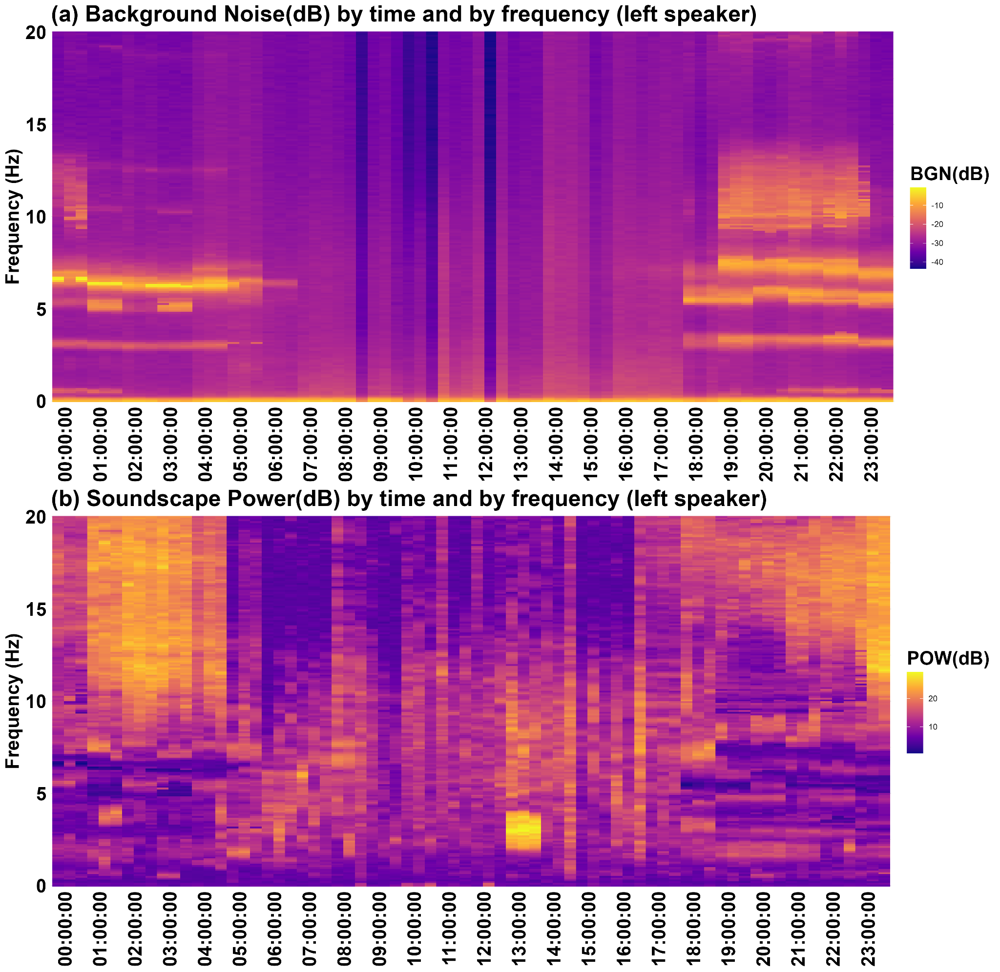

# Summary

Noise is defined as disruptive sound that interferes with acoustic communication and may affect biodiversity and human health. The increasing production of large-scale acoustic data has intensified the need for tools to quantify background noise within soundscapes in a efficient way. Already existing R packages provide useful tools for computing acoustic metrics, but lack newer indices. To address this gap, we introduce `Ruido`, an R package that computes three key metrics: Background Noise (BGN), Soundscape Power (POW), and Soundscape Saturation (SAT). BGN represents persistent sound intensity, POW measures the distinctiveness of transient acoustic events, and SAT estimates the density of acoustic activity as a proxy for biological richness. These metrics enable more comprehensive characterization of soundscape dynamics and facilitate large-scale ecoacoustic analyses. 

# State of The Field

Sounds are perceived as noise when they are unwanted, disruptive, jeopardize communication, or pose a risk to human health [@fink_comprehensive_2025]. Regardless of their source, certain persistent sounds act as background noise, shaping the structure and dynamics of acoustic communication systems [@brumm_acoustic_2005]. Given the implications of both anthropogenic and natural noise on biodiversity and human health, there is a growing demand to measure and characterize background persistent noises across diverse spatial contexts [@pijanowski_soundscape_2011].

The field of soundscape research has undergone significant evolution in response to the increasing demand for processing large-scale acoustic data. The widespread adoption of autonomous acoustic monitoring systems has led to an unprecedented number of recordings, thereby expanding opportunities for investigating background noise patterns and catalyzing the development of advanced data processing and analysis techniques. Extracting environmental information from soundscape recordings is a powerful yet challenging task. To address this, researchers have developed acoustic metrics, which are quantitative tools that summarize the distribution and intensity of acoustic energy within a soundscape by analyzing waveform and spectrogram features [@alcocer_acoustic_2022]. 

# Statement of Need

Given the growing use of acoustic metrics in soundscape analysis, recent efforts have focused on developing accessible and standardized tools to support ecoacoustic research [@alcocer_acoustic_2022; @bradfer-lawrence_guidelines_2019]. In response, several R packages, such as soundecology [@pijanowski_soundecology_2018], seewave [@sueur_seewave_2025], and warbleR [@araya-salas_warbler_2017], have made it easier to compute acoustic metrics and visualize sound data, even for researchers with limited programming skills. 

Although these R packages offer a wide range of acoustic metrics, they often lack support for some newer measures. To address this gap, we present `Ruido`, an R package designed to efficiently compute three key acoustic metrics: Background Noise (BGN), Soundscape Power (POW), and Soundscape Saturation (SAT). Building upon the conceptual framework introduced by @towsey_calculation_2017, these metrics are implemented in a streamlined, scalable, and fully reproducible workflow within the R environment, enabling their application across large audio datasets. 

In this work, we define Background Noise (BGN) as the modal decibel intensity within each frequency window of a spectrogram. Therefore, high BGN values often reflect geophonic sources like wind and rain, which produce steady low-frequency sounds across environments. In contrast, anthropogenic noise, though less constant, is typically louder and a dominant contributor to soundscape background levels [@luther_sources_2013]. The output of the BGN function is a matrix in which each cell represents the background noise level for a specific time-frequency bin. 

To complement the BGN evaluation, @towsey_calculation_2017 proposed the Soundscape Power (POW), formerly referred to as the Signal-to-Noise Ratio. POW is defined as the difference between the maximum and modal decibel values within each frequency window. It quantifies how distinct episodic acoustic events are from persistent background noise. Both metrics provide valuable insights into the temporal and spectral dynamics of background noise. 

The third index, Soundscape Saturation (SAT), has gained traction in recent ecoacoustic studies as a proxy for biological activity and acoustic richness [@burivalova_sound_2021]. While its conceptual foundations are less formally established than BGN or POW, SAT is complementary and reflects the proportion of time-frequency bins exceeding a given amplitude threshold, which captures the density of acoustic events across the soundscape. This metric aligns with the acoustic niche hypothesis, which proposes that coexisting species adjust their vocal timing or frequency to minimize overlap and competition for acoustic space [@krause_niche_1987]. In more stable environments, species tend to partition the soundscape by occupying distinct frequency bands, resulting in higher frequency occupancy [@krause_measuring_2011]. Consequently, greater acoustic saturation often indicates a richer vocal community [@gasc_future_2017]. 

Finally, by operationalizing these emerging metrics alongside established indices, `Ruido` simplifies ecoacoustic workflows and enhances researchers’ capacity to analyze large soundscape collections with minimal effort. 

# Example 1

To illustrate the application of the available metrics in the `Ruido` package, we present a first example depicting the diurnal variation of BGN and POW using the bgnoise() function. These acoustic metrics were derived from 24 stereo recordings captured over a full day using a Song Meter SM4 (Wildlife Acoustics), programmed to record 3 minutes every 10 minutes at a 48 kHz sampling rate and 16 bit resolution. We selected only the first recording of each hour to analyse. Only the left channel, configured with 16 dB gain, was used for analysis. Data were gathered on April 1st during the rainy season in a jurema preta forest (monodominance of *Mimosa tenuiflora*) at the campus of the Universidade Federal Rural do Semi-Árido (UFERSA) in Mossoró-RN, Northeastern Brazil (Figure 1). All recordings used in this example are available at <https://zenodo.org/records/17243660>, ensuring full reproducibility and allowing users to replicate the analyses presented. 

![**Figure 1.** Location of the SM4 autonomous recorder used for the acoustic data collection used in examples 1 and 2. (a) Geographic location of the study area in Mossoró, Potiguar region, Rio Grande do Norte, Brazil. (b) Satellite image of the landscape during the rainy season, showing the position of the SM4 recorder (red cross) and its approximate detection range (dashed red circle). (c) Photograph of the deployed SM4 recorder installed in a forest dominated by *Mimosa tenuiflora* during the dry season.](figures/mapPaper.png)

After organizing the audio files into the appropriate directory structure, we proceeded with the analysis using the default settings for the function arguments, which are: channel = “stereo”, time_bin = 60, dbThreshold = -90, targetSampRate = NULL, wl = 512, window = signal::hamming(wl), overlap = ceiling(length(window) / 2), and histbreaks = “FD”. These parameters can be customized according to the users' specific needs and analytical goals, allowing for flexible adaptation to different research contexts and objectives. For instance, users may choose a different channel configuration (e.g., mono vs. stereo), adjust the time_bin to refine temporal resolution, modify the dbThreshold to control sensitivity to low-amplitude signals, or select alternative window types and overlap values to optimize spectral analysis. Such flexibility ensures that the function can be tailored to a wide range of analytical objectives. The script lines are as follows: 

``` r
dir <- tempdir()
recName <- paste0("GAL24576_20250401_", sprintf("%06d", seq(0, 230000, by = 10000)),".wav")

for(rec in recName) {
 print(rec)
 url <- paste0("https://zenodo.org/records/17243660/files/", rec, "?download=1")
 download.file(url, destfile = paste(dir, rec, sep = "\\"), mode = "wb")
}

audios <- list.files(dir, full.names = TRUE, recursive = TRUE, pattern = ".wav")

ruido <- lapply(audios, function(x) {
  bgNoise(x)
})
```

The results are stored in a list comprising four matrices (256 x 3), each containing the BGN and POW values for both sides of the recording, along with a named vector containing the time (in seconds) of each temporal bin. A subset of these data can be visualized using the head() function. The number of rows in each matrix corresponds to half of the window length, whereas the number of columns corresponds to the number of temporal bins (definied by the user). 

``` r
> head(noise[[1]]$left$BGN)
        BGN1       BGN2       BGN3
1  -7.129644  -7.428596  -7.380979
2 -11.448206 -10.724964 -10.925195
3 -17.541458 -16.871005 -17.760030
4 -23.345778 -23.222611 -25.034511
5 -24.367839 -24.949902 -24.108468
6 -19.794834 -20.351808 -22.525614

> head(noise[[1]]$left$POW)
      POW1     POW2     POW3
1 5.908507 7.428596 5.557252
2 7.035147 7.342165 6.132567
3 5.106587 5.531298 4.831514
4 4.597742 4.732260 5.902134
5 6.863784 8.603954 5.856930
6 8.822616 7.882595 9.031331

> head(noise[[1]]$timeBins)
BIN1 BIN2 BIN3 
  60   60   60
```

Notably, BGN levels tended to be less intense and more evenly distributed across frequencies during daytime hours, while at night they became more intense and concentrated particularly between 5 and 12 kHz. Soundscape power also increased during nighttime, especially at frequencies above 8 kHz. These patterns reflect distinct acoustic dynamics between day and night periods. The results of BGN and POW for the left channel can be seen in figures 2a and 2b. 



# Example 2

The recordings were made with the same configuration described in Example 1, with all function arguments set to default, which are: channel = “stereo”, time_bin = 60, dbThreshold = -90, targetSampRate = NULL, wl = 512, window = signal::hamming(wl), overlap = ceiling(length(window) / 2), histbreaks = “FD”, powthr = c(5.1, 20, 0.1), bgnthr = c(0.51, 0.99, 0.02), normality = “ad.test”, and backup = NULL. The `Ruido` package provides a straightforward method for calculating the SAT via the soundsat() and sat_backup() functions. In this example, we computed SAT for each 24-hour cycle to quantify the proportion (%) of occupied frequency bands. The script lines are as follows: 

``` r
dir <- tempdir()
recName <- paste0("GAL24576_20250401_", sprintf("%06d", seq(0, 230000, by = 10000)),".wav")
for(rec in recName) {
 print(rec)
 url <- paste0("https://zenodo.org/records/17243660/files/", rec, "?download=1")
 download.file(url, destfile = paste(dir, rec, sep = "\\"), mode = "wb")
}

sat <- soundSat(dir)

 The resulted output is exhibited as follows:
> head(sat$values)
                                        PATH                        AUDIO     BIN DURATION       SAT
1 C:/Users/OAS/AppData/Local/Temp/RtmpaMiEEV GAL24576_20250401_000000.wav  left_1       60 0.4218750
2 C:/Users/OAS/AppData/Local/Temp/RtmpaMiEEV GAL24576_20250401_000000.wav  left_2       60 0.4492188
3 C:/Users/OAS/AppData/Local/Temp/RtmpaMiEEV GAL24576_20250401_000000.wav  left_3       60 0.4062500
4 C:/Users/OAS/AppData/Local/Temp/RtmpaMiEEV GAL24576_20250401_000000.wav right_1       60 0.4179688
5 C:/Users/OAS/AppData/Local/Temp/RtmpaMiEEV GAL24576_20250401_000000.wav right_2       60 0.4765625
6 C:/Users/OAS/AppData/Local/Temp/RtmpaMiEEV GAL24576_20250401_000000.wav right_3       60 0.4101562

> sat$powthresh
[1] 12.5
> sat$bgntresh
[1] 99
> sat$normality
[1] 0.000740162
```

We subsequently calculated mean values for each hour of the day, along with corresponding confidence intervals, to visualize the results in a time series graph (Figure 3). This approach provides a practical example of how users can process and explore their own data to identify temporal patterns and assess acoustic variability. 


The SAT showed substantial variation throughout the day, with pronounced peaks occurring both during the early nighttime hours and at dusk. The nocturnal acoustic richness, likely driven by vocalizing frogs and insects, reflects characteristic soundscape patterns of the rainy season in semiarid environments.

# Conclusion

Finally, our practical examples highlighted that the package offers a user-friendly and flexible framework for acoustic data analysis, enabling researchers to efficiently process large datasets, replicate workflows across extended temporal scales, and extract meaningful patterns with minimal coding effort. Its accessibility empowers broader adoption of ecoacoustic methods and fosters deeper insights into soundscape ecology.

# Acknowledgements

We are grateful to the Financiadora de Estudos e Projetos (FINEP) for financial support through the Escutadô Project (grant number 01.23.0702.00).

# References
