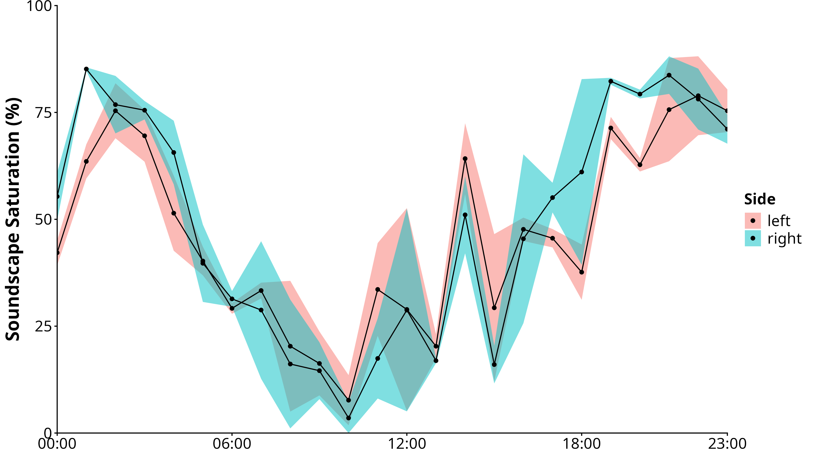

# Summary

Noise disrupts communication and impacts biodiversity and health. The demand to process acoustic data has increased the need for efficient tools to quantify soundscape noise. `Ruido` extends R’s acoustic tools by adding three key indices: Background Noise (BGN), Soundscape Power (POW), and Soundscape Saturation (SAT). BGN represents persistent sound intensity, POW measures the distinctiveness of transient acoustic events, and SAT estimates the density of acoustic activity as a proxy for biological richness. These metrics enable more comprehensive characterization of soundscape dynamics and facilitate large-scale ecoacoustic analyses.

# Statement of Need

Given the growing use of acoustic metrics in soundscape analysis, recent efforts have focused on developing accessible and standardized tools to support ecoacoustic research [@alcocer_acoustic_2022; @bradfer-lawrence_guidelines_2019]. In response, several R packages, such as soundecology [@pijanowski_soundecology_2013], seewave [@sueur_seewave_2025], and warbleR [@araya-salas_warbler_2017], have made it easier to compute acoustic metrics and visualize sound data, even for researchers with limited programming skills.

Although these R packages offer a wide range of acoustic metrics, they lack measures focused on background noise. To address this gap, we present `Ruido`, an R package designed to efficiently compute three key acoustic metrics: Background Noise (BGN), Soundscape Power (POW), and Soundscape Saturation (SAT). Building upon the conceptual framework introduced by @towsey_calculation_2017 and @burivalova_using_2018, these metrics are implemented in a streamlined, scalable, and fully reproducible workflow within the R environment, enabling their application across large audio datasets.

# Software Design

The package aims to offer a user-friendly and flexible framework for acoustic data analysis, enabling researchers to efficiently process large acoustic collections, replicate workflows across extended temporal scales, and extract meaningful patterns with minimal coding effort. Its accessibility empowers broader adoption of ecoacoustic methods and fosters deeper insights into soundscape ecology. By operationalizing emerging metrics alongside established indices, `Ruido` simplifies ecoacoustic workflows and enhances researchers’ capacity to analyze large soundscape collections with minimal effort.

# Research Impact Statement

The package also aims to assist future studies of the growing field of ecoacoustics. To guide users, the repository and documentation contain fully reproducible tests to provide examples to the package's capabilities and functioning. `Ruido` has been added to the pipeline of the Escutadô Project, a large-scale research iniciative aiming to describe soundscapes of the Brazilian Semiarid region.

# Example

We show a case study with `soundSat()` to illustrate daily variation in soundscape saturation. We used 24 stereo recordings of 3 minutes each, captured hourly over a day with a Song Meter SM4 (Wildlife Acoustics) at 48 kHz and 16-bit resolution. Recordings were collected on April 1st 2025 in a semiarid forest dominated by Mimosa tenuiflora in Mossoró‑RN, Brazil, and are publicly available at <https://zenodo.org/records/17243660> for reproducibility and allowing users to replicate the analyses presented.

In this example, SAT quantified the proportion of occupied frequency bands over a 24‑hour cycle of audio samples. The analysis used the package’s default parameters: channel = “stereo”, time_bin = 60, dbThreshold = -90, targetSampRate = NULL, wl = 512, window = signal::hamming(wl), overlap = ceiling(length(window)/2), histbreaks = “FD”, powthr = c(5.1, 20, 0.1), bgnthr = c(0.51, 0.99, 0.02), normality = “ad.test”, beta = TRUE, and backup = NULL. The script lines are as follows:

``` r
dir <- tempdir()
recName <- paste0("GAL24576_20250401_", sprintf("%06d", seq(0, 230000, by = 10000)),".wav")
for(rec in recName) {
 print(rec)
 url <- paste0("https://zenodo.org/records/17243660/files/", rec, "?download=1")
 download.file(url, destfile = paste(dir, rec, sep = "/"), mode = "wb")
}

sat <- soundSat(dir)
```

The resulted output is exhibited as follows:

``` r
> head(sat$values)
             PATH                        AUDIO CHANNEL DURATION BIN SAMPRATE       SAT
1 /tmp/RtmptnAWmi GAL24576_20250401_000000.wav    left       60   1    48000 0.3906250
2 /tmp/RtmptnAWmi GAL24576_20250401_000000.wav    left       60   2    48000 0.4492188
3 /tmp/RtmptnAWmi GAL24576_20250401_000000.wav    left       60   3    48000 0.4257812
4 /tmp/RtmptnAWmi GAL24576_20250401_000000.wav   right       60   1    48000 0.5312500
5 /tmp/RtmptnAWmi GAL24576_20250401_000000.wav   right       60   2    48000 0.5117188
6 /tmp/RtmptnAWmi GAL24576_20250401_000000.wav   right       60   3    48000 0.6171875

> sat$powthresh
[1] 20
> sat$bgntresh
[1] 60
> sat$normality
$test
[1] "ad.test"

$statistic
[1] 1.730193
```

With the default parameters, SAT values are calculated for each minute of a recording. Therefore, hourly SAT mean and standard deviation were obtained by averaging the three values, as detailed in the GitHub repository (Figure 1): <https://github.com/Arthurigorr/Ruido/>. This approach provides a practical example of how users can process and explore their own data to identify temporal patterns and assess acoustic variability.



# AI Usage Disclosure

AI tools were used to fix spelling errors in documentation and manuscript.

# Acknowledgements

We are grateful to the Financiadora de Estudos e Projetos (FINEP) for financial support through the Escutadô Project (grant number 01.23.0702.00).

# References
